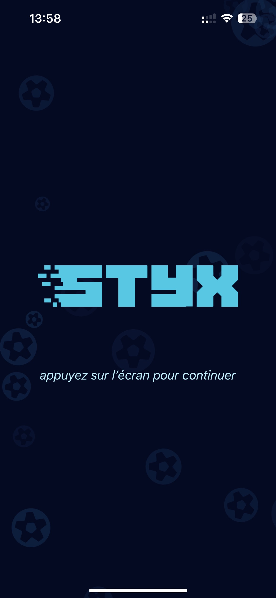
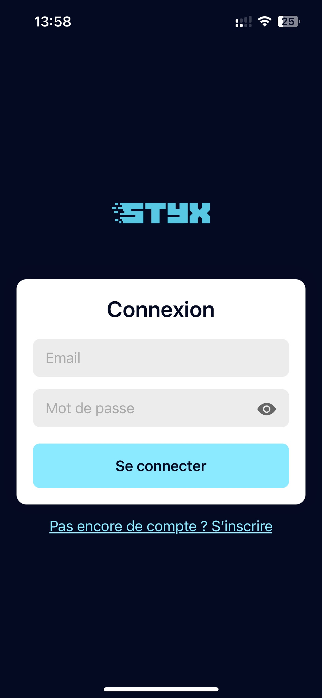
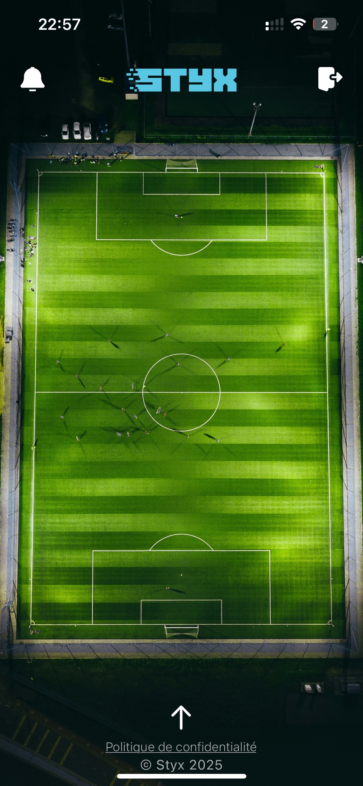
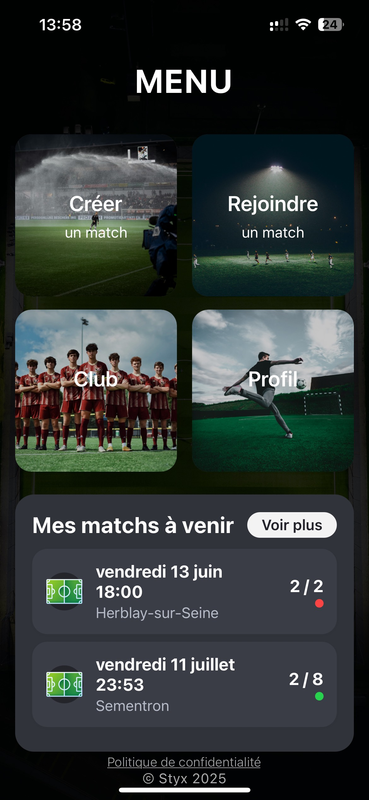
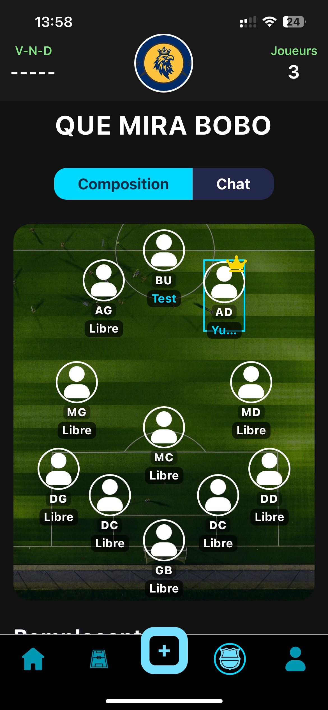

# ⚽ STYX – Application mobile de gestion de matchs de football
<p align="center">  </p>


## 🚀 Présentation
STYX est une application mobile pensée pour les passionnés de football, qui permet de :

    - Rejoindre ou organiser des matchs facilement dans sa région

    - Gérer ses équipes et ses participations

    - Visualiser ses matchs à venir ou passés dans une interface moderne et intuitive

L’application est développée en React Native (Expo) pour le front et Symfony pour l’API backend.

---

## ✨ Fonctionnalités principales
    
    - 🔑 Inscription et authentification utilisateur

    - 🗺️ Découverte et inscription à des matchs

    - 📋 Gestion de ses propres matchs (“Mes Matchs”)

    - 🏆 Création et gestion de clubs/équipes

    - 🔎 Filtres avancés (date, niveau, proximité…)

    - 🎨 UI mobile responsive et direction artistique sur mesure

---    

## 🛠️ Stack technique

    - Frontend : React Native (Expo)

    - Backend : Symfony (API REST)

    - Base de données : MySQL (Docker en local)

    - Déploiement : Platform SH (backend), Expo Go/TestFlight (frontend)

---

## 🌐 Démo en ligne

    - Backend API : https://main-bvxea6i-y25mlzc6no7vs.ch-1.platformsh.site/

    - Frontend : (Déploiement sur Store en cours – testable via Expo)

---


## 🏗️ Installation locale
**Prérequis**
    - Node.js, npm/yarn

    - Docker

    - Expo CLI

    - PHP 8+, Composer


### 1. Cloner le projet
```
git clone https://github.com/Baguimon/STYX.git
cd STYX
```


### 2. Lancer la base de données
```
cd backend
docker compose up -d
```

**Accès phpMyAdmin : http://localhost:8080**


### 3. Lancer le backend (Symfony)

```
composer install
php bin/console doctrine:migrations:migrate
symfony serve
```


### 4. Lancer le frontend (Expo)
```
cd frontend
npm install
npx expo start
```

---  


## 🚢 Déploiement production

    - Backend : déployé sur Platform SH: https://main-bvxea6i-y25mlzc6no7vs.ch-1.platformsh.site/

    - Frontend : prévu pour publication sur App Store/Play Store via Expo

---

## 🔒 Sécurité & RGPD
    
    - Authentification en cours d’amélioration (intégration JWT prévue)

    - Données utilisateurs protégées, suppression sur demande possible

    - Mise en conformité RGPD prévue (mentions légales, anonymisation)


---


## 👥 Contributeurs
    
    - Yoann LE CHEVALIER — Front principal, UI/UX, backend partiel

    - Mathis TRUONG — Backend principal, DevOps

    - Timothé WINKLER — Fullstack, gestion projet


---

## 🗺️ Roadmap
    
    - Intégration sécurité JWT + gestion rôles

    - Notifications push mobiles

    - Tests unitaires backend et frontend

    - Publication sur App Store / Play Store


---

## 🐞 Bugs connus
    
    - Quelques lenteurs d’affichage en cas de mauvaise connexion

    - Sécurité API à renforcer (prochaine release)

## 📄 Licence

Projet privé — usage pédagogique (CDA 2024)


---

## 📸 Aperçu de l’application

<p align="center">  
  
  
  
  
  
  
  
</p>

